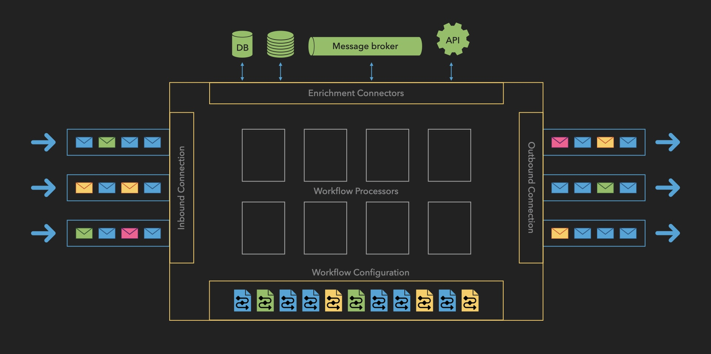

# How the Product Works

The Message Processor operates through a streamlined workflow that orchestrates the processing of payment messages from reception to dispatch. Here’s a step-by-step explanation of how the system functions:

### Inbound Connection

- **Message Reception**: A new payment message is received from the inbound connection. This could be from various sources such as bank APIs, financial gateways, or other external systems.
- **Queue Placement**: The received message is placed into an inbound queue, making it ready for processing.

### Workflow Processor

- **Message Retrieval**: The Workflow Processor pulls the message from the inbound queue.
- **Workflow Matching**: It matches the message to the appropriate workflow based on predefined criteria such as payment type, originator, region, and other relevant fields.
- **Workflow Definition**: The selected workflow outlines the specific steps required to process the payment, tailored to the message’s attributes.

### Workflow Execution

- **Enrichment**: The system enriches the message by adding necessary customer data, account details, or other relevant information. This is often done by interacting with **Enrichment Connectors** that fetch data from external databases or services.
- **Validation**: The message undergoes validation checks to ensure accuracy, completeness, and compliance with regulatory and business rules.
- **Transformation**: The message is transformed into the required format (e.g., ISO 20022, SWIFT MT), supporting various industry standards to meet internal specifications or the requirements of the outbound systems.
- **Step Completion**: Each step in the workflow is executed sequentially, ensuring that the message is fully prepared for dispatch.

### Error Handling and Logging

- **Error Detection**: If any errors occur during processing—such as validation failures or issues in data enrichment—the system detects them immediately.
- **Retry Logic**: The system attempts to resolve transient errors through automated retry mechanisms, ensuring minimal disruption in processing.
- **Error Queue**: Persistent errors result in the message being moved to an error queue for further analysis or manual intervention.
- **Auditing and Logging**: The entire process is thoroughly logged, creating an audit trail for compliance purposes. This includes recording each step taken, data changes, processing times, and any errors encountered.

### Outbound Connection

- **Message Dispatch**: Upon successful completion of all workflow steps, the final, processed message is dispatched to one or more outbound systems.
- **Multiple Destinations**: Destinations can include payment networks, financial institutions, clearinghouses, or other specified endpoints.
- **Confirmation Handling**: The system may handle acknowledgments or confirmations from the outbound systems, updating the status of the message accordingly.

---

This comprehensive process ensures that each payment message is:

- **Accurately Processed**: By following the appropriate workflow tailored to the message’s characteristics.
- **Enriched and Validated**: Ensuring all necessary information is included and compliant with all relevant regulations.
- **Correctly Transformed**: Adjusted into the required format for seamless integration with outbound systems.
- **Reliably Dispatched**: Sent to the correct destinations efficiently and securely.
- **Fully Audited**: With detailed logs maintained for transparency and regulatory compliance.

---

By integrating the Message Processor into your payment infrastructure, you can achieve greater operational efficiency, compliance, and adaptability, positioning your institution at the forefront of modern payment processing.